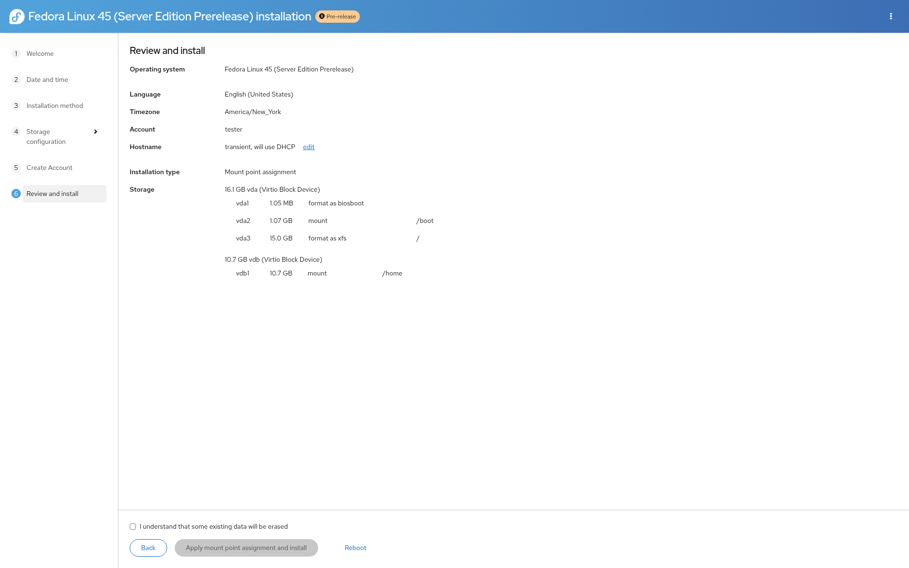

.. This page is included from docs/installation-steps.rst. Shown only for "Mount point assignment" scenario.
   Content adapted from the Fedora Installation Guide (Installing Using Anaconda).

Manual disk configuration
--------------------------

The Manual disk configuration screen allows you to create a storage configuration for your system manually, giving you full control over the partition layout.

Unlike a purely "bottom-up" approach (where you first create physical volumes, then volume groups, then logical volumes), the installer lets you define the mount points you need (such as ``/``, ``/home``, ``/boot``) and their sizes; the underlying layout (volume groups, logical volumes, or standard partitions) is created accordingly. You can then adjust device types, file systems, and other settings for each mount point.

When you first open this screen, the left side shows existing partitions on the disks you selected, or a message that no mount points exist yet. Add mount points (for example ``/`` with a size like ``50GB``), then select each one to configure its device type, file system, and which disks it may use. Remove mount points you do not need.

.. note::
   No permanent changes are made to your disks until you start the installation. The configuration you set here is only written when you begin the installation on the Review and install screen.

Some mount points have restrictions: for example, ``/boot`` typically must be on a standard partition, not on an LVM logical volume or Btrfs subvolume. The installer will report any errors in your configuration so you can correct them before proceeding.

After you finish configuring storage, confirm to return to the next step.
